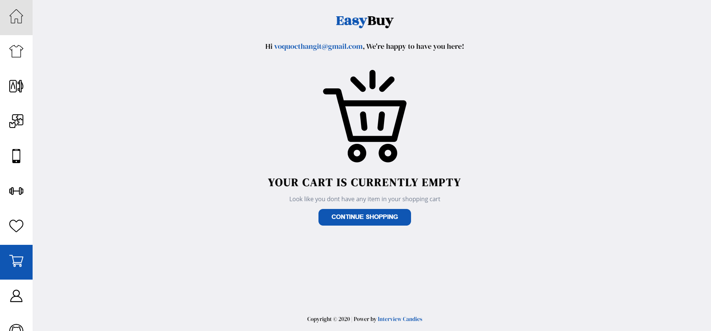

# EasyBuy

E-commercial website to buy stuff online.  
The main purpose of this project is to learn and pratice with Reactjs.

## Website

https://interviewcandies.github.io/Easy-Buy

## User Interface

### Home

### Product details

### WishList

### Cart

## Technologies

- React
- Firebase
- Styled Components

## What I learned

- Features of react-router-dom such as { HashRouter, Switch, useHistory }
- Firebase authentication
- Error Boundary

## Things to improve

- Apply redux
- Add Dark mode
- Using Typescript
- Build my own server

## Credits

- [react-hook-form](https://github.com/react-hook-form/react-hook-form)
- [material-ui](https://github.com/mui-org/material-ui)
- [react-elastic-carousel](https://github.com/sag1v/react-elastic-carousel)
- [react-spinners](https://github.com/davidhu2000/react-spinners)
- [react-error-boundary](https://github.com/bvaughn/react-error-boundary)

## Contact

- [Linkedin](https://www.linkedin.com/in/voqthang/)
- Email: voquocthangit@gmail.com
